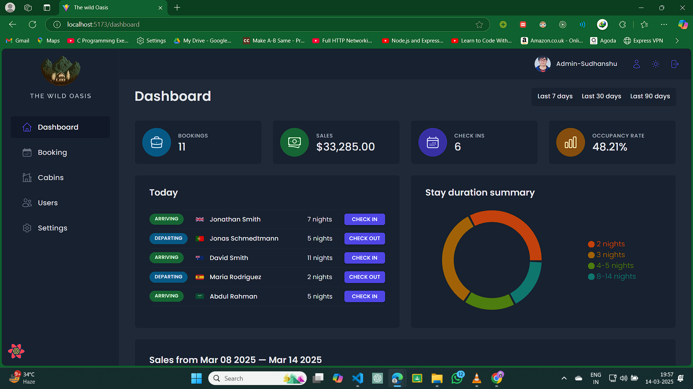

# The Wild Oasis

**The Wild Oasis** is a fully-featured hotel management web application built
using **React** and modern libraries. It is designed for hotel employees to
manage cabins, bookings, and guests efficiently, with secure login and intuitive
dashboards.

---




## 🚀 Features

### 🔐 Authentication & User Management

- **Hotel Employees Only**: Only verified hotel employees can create accounts
  directly within the application.
- **Secure Login**: Employees must log in to access the app.
- **User Profile Management**:
  - Upload and update **avatar**.
  - Change **name** and **password**.

---

### 🏡 Cabin Management

- **View All Cabins**: Table view displaying:
  - Cabin **photo**, **name**, **capacity**, **price**, and **current
    discount**.
- **CRUD Operations**:
  - Create new cabins (with photo upload).
  - Update existing cabins.
  - Delete cabins.

---

### 📅 Booking Management

- **View All Bookings**: Table view showing:
  - **Arrival and departure dates**, **status**, **paid amount**.
  - Associated **cabin** and **guest** data.
- **Filterable by Status**:
  - **Unconfirmed** (booked but not yet checked in).
  - **Checked in**.
  - **Checked out**.
- **Other Booking Details**:
  - Number of **guests**, number of **nights**, guest **observations**.
  - Whether **breakfast** was booked, and **breakfast price**.
- **Booking Actions**:
  - **Check-in/Check-out** guests directly from the table.
  - **Delete** bookings.
  - **Accept payment** confirmation on check-in (payment processed outside the
    app).
  - **Add breakfast** for entire stay during check-in (if not already included).

---

### 🧑 Guest Data

- **Detailed Guest Information**:
  - Full **name**, **email**, **national ID**, **nationality**, and **country
    flag** for easy identification.

---

### 📊 Dashboard & Insights

- **Daily Operations View**:
  - List of guests **checking in and out** on the current day with quick action
    buttons.
- **Booking & Sales Statistics**:
  - **Bookings**, **sales**, **check-ins**, and **occupancy rate** for the last
    **7, 30, or 90 days**.
- **Charts & Analytics**:
  - **Daily sales chart**: Displays **total sales** and **extras (breakfast)**.
  - **Stay duration statistics** chart: Analyze length of guest stays.

---

### ⚙️ Application-wide Settings

- Adjustable settings for:
  - **Breakfast price**.
  - **Minimum and maximum nights** per booking.
  - **Maximum guests** per booking.

---

### 🌗 Dark Mode

- **Dark mode** support for a comfortable user experience.

---

## 🛠️ Tech Stack

- **React** (UI library)
- **React Router** (Routing)
- **Styled Components** (Component styling)
- **React Query** (Data fetching and caching)
- **Context API** (State management)
- **React Hook Form** (Form handling)
- **React Icons** (Icons)
- **React Hot Toast** (Toast notifications)
- **date-fns** (Date utilities)
- **Supabase** (Authentication, Database, Storage)

---

## 📦 Installation

Clone the repository:

```sh
git clone https://github.com/Persephones-hades101/the-wild-oasis.git
cd the-wild-oasis
```

Install dependencies:

```sh
npm install
```

## 🚀 Running the Project

Make sure to set up a **Supabase** project and put a `supabase.js` file into the
`src/services` folder.  
A PNG file for the Supabase schema is present in
`src/data/supabase-schema.png`.  
So create all the tables as required in the schema.

Start the development server:

```sh
npm run dev
```

The app will be available at: **http://localhost:5173/**

## 🤝 Contributing

1. Fork the repository
2. Create a new branch (`git checkout -b feature-branch`)
3. Commit changes (`git commit -m 'Add new feature'`)
4. Push to your branch (`git push origin feature-branch`)
5. Open a Pull Request

## 📞 Contact

For any queries, reach out to [sudh4800@gmail.com].

## License


This project is licensed under the [MIT License](./LICENSE).
